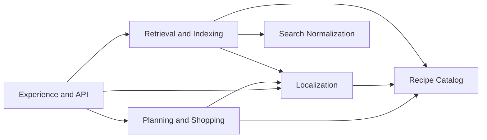

# Context Map

## Scope

This document defines bounded contexts, ownership, interactions, and dependency direction.

Normative source:

- [Multilingual Architecture Specification](../multilingual-architecture.md)

Related documents:

- [Data Model](data-model.md)
- [Localization](localization.md)
- [Search Normalization](search-normalization.md)
- [Retrieval](retrieval.md)
- [API Contract](api-contract.md)

## Bounded Contexts

### Recipe Catalog Context

Ownership:

- canonical recipe identity
- canonical ingredient identity
- canonical tags and units as taxonomy and measurement concepts
- canonical relationships across recipe structures

Primary concepts:

- Recipe
- Ingredient
- Tag
- Unit
- RecipeCombination

### Localization Context

Ownership:

- translation assets for canonical concepts
- fallback and language policy rules
- translation metadata and provenance

### Search Normalization Context

Ownership:

- lexical normalization artifacts
- alias and synonym rules
- morphology and regional vocabulary normalization
- preprocessing for keyword and semantic retrieval input

### Retrieval and Indexing Context

Ownership:

- semantic projection generation and version handling
- indexing profiles and retrieval profile orchestration
- vector metadata and canonical identity resolution
- merge and ranking composition

### Planning and Shopping Context

Ownership:

- meal planning workflows
- shopping list generation using canonical identities and localized read models

### Experience and API Context

Ownership:

- language negotiation and resolution at system edge
- localized response composition
- localization observability metadata in responses

## Interaction Contracts

1. Recipe Catalog exposes canonical identity and relationship contracts.
2. Localization consumes canonical identity and returns localized read-model contracts.
3. Search Normalization produces normalized query contracts consumed by retrieval and query services.
4. Retrieval and Indexing consumes canonical identity plus localized projections and returns canonical-attributed retrieval outputs.
5. Experience and API consumes localized read models and exposes localization metadata.

## Ownership Matrix

| Concern | Owner Context | Notes |
| --- | --- | --- |
| Canonical IDs and invariants | Recipe Catalog | Language-independent identity is mandatory |
| Translation assets | Localization | No canonical duplication by language |
| Query lexical normalization | Search Normalization | Shared by keyword, semantic, OCR, voice paths |
| Vector retrieval strategy | Retrieval and Indexing | Strategy-agnostic profile model |
| Language negotiation at interface | Experience and API | Mapped to LocalizationOptions in app layer |
| Planning and shopping outputs | Planning and Shopping | Consumes canonical + localized read models |

## Dependency Graph

Dependency constraints:

1. Domain concerns do not depend on infrastructure concerns.
2. Localization policy does not depend on transport details.
3. Retrieval orchestration depends on abstraction ports, not concrete providers.

## Open Items

- TODO: Define formal interaction contract schemas per context boundary.
- TODO: Define contract change process and compatibility review gate between contexts.
