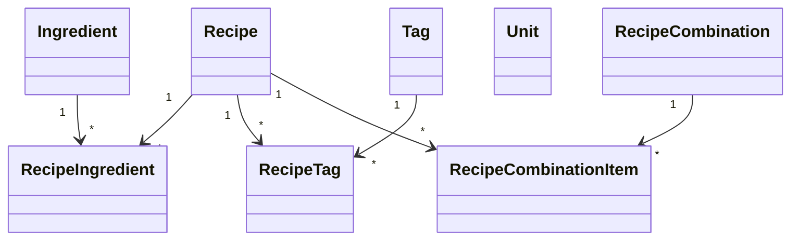

# Conceptual Data Model

## Scope

This document defines the conceptual domain model only.

It does not define physical database schema or provider-specific structures.

Normative source:

- [Multilingual Architecture Specification](../multilingual-architecture.md)

Related documents:

- [Persistence](persistence.md)
- [Localization](localization.md)
- [Glossary](glossary.md)

## Core Modeling Principles

1. Canonical identity is language-independent.
2. Canonical entities are never duplicated by language.
3. Domain invariants are enforced in canonical aggregates, not localized read models.

## Canonical Entities

Primary entities:

- Recipe
- Ingredient
- Tag
- Unit
- RecipeCombination

Relationship entities:

- RecipeIngredient
- RecipeTag
- RecipeCombinationItem

Identity invariants:

- canonical IDs are immutable
- canonical IDs are unique

## Value Objects

Value objects required by architecture:

- LanguageContext
- LocalizationOptions

Boundary rule:

- LanguageContext is user-facing and application-facing.
- LocalizationOptions is repository-facing and query-facing.

## Aggregate Roots

Canonical aggregate roots:

- Recipe
- Ingredient
- Tag
- Unit
- RecipeCombination

Notes:

- Write-side operations must use canonical aggregate roots only.
- Localized representations are read models and are not canonical aggregate roots.

## Localized Read Models

Localized read model families:

- LocalizedRecipe
- LocalizedIngredient
- LocalizedTag
- LocalizedRecipeCombination

These are consumer projections and are outside canonical aggregate invariants.

## Conceptual Relationships

1. Recipe to Ingredient is many-to-many via RecipeIngredient.
2. Recipe to Tag is many-to-many via RecipeTag.
3. RecipeCombination references one or more Recipes via RecipeCombinationItem.
4. Tag and Unit are canonical references, not free-text attributes.
5. Translation assets reference canonical identities; they do not create alternate identity spaces.

## Conceptual Model Diagram

## Explicitly Out of Scope

- column definitions
- table naming
- key strategy details
- indexing structures
- provider-specific types

See [Persistence](persistence.md) for provider-independent mapping guidelines.

## Open Items

- TODO: Define conceptual invariants for optional localized recipe-ingredient authored text granularity.
- TODO: Confirm whether Region becomes part of first-class conceptual identity or remains policy-only metadata.
