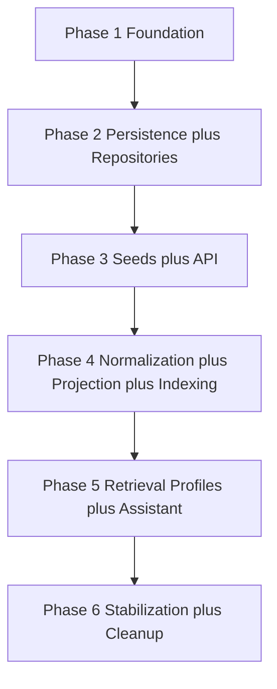

# Multilingual Implementation Plan

## 1. Purpose

This document is the AI-executable implementation contract for migrating the .NET solution to the approved multilingual architecture.

Authoritative architecture sources:

- [Canonical Specification](../multilingual-architecture.md)
- [Architecture Set Overview](../architecture/README.md)
- [ADR Index](../adr/README.md)

This plan optimizes execution sequence, phase size, and developer productivity for a single engineer with AI-assisted development.

This plan does not redesign architecture and does not introduce alternative architectural approaches.

## 2. Non-Negotiable Constraints

Every phase must preserve all of the following:

1. Canonical IDs remain immutable and unique.
2. Canonical entities are never duplicated by language.
3. Backward compatibility is preserved whenever possible.
4. Deterministic semantic projection behavior is preserved.
5. Deterministic indexing behavior is preserved.
6. Incremental indexing support via deterministic fingerprints is preserved.
7. Application remains compilable and testable at the end of each phase.

## 3. Phase Consolidation Analysis

The prior 14-phase plan is reorganized into 6 phases to reduce context switching and repeated edits in the same modules.

Consolidation decisions:

1. Former phases 0, 1, and 2 are merged.
Reason:
- Baseline tests, shared contracts, and domain separation all touch the same foundational code and tests.
- Splitting them causes repeated refactoring of domain and contract boundaries.

2. Former phases 3 and 4 are merged.
Reason:
- Persistence changes and localized repository/query services are tightly coupled and should be implemented together to avoid transitional mapping churn.

3. Former phases 5 and 6 are merged.
Reason:
- Seed migration and API localization behavior are customer-visible together and share compatibility validation.

4. Former phases 7, 8, and 9 are merged.
Reason:
- Search normalization, deterministic projection, and fingerprint indexing form one technical pipeline and are safer when delivered as one coherent slice.

5. Former phases 10 and 11 are merged.
Reason:
- Retrieval profiles and assistant propagation share language-context flow and retrieval contracts.

6. Former phases 12 and 13 are merged.
Reason:
- Test hardening and cleanup should finalize the migration in one stabilization milestone.

Risk posture of consolidation:

- Risk is reduced by minimizing repeated edits in the same code paths.
- Dependency ordering is preserved.
- Each phase remains independently working, compilable, and testable.

## 4. Implementation Rules

These rules apply in every phase.

1. Continuously refactor touched code.
2. Remove obsolete code in touched modules.
3. Remove dead abstractions in touched modules.
4. Improve naming consistency in touched modules.
5. Reduce duplication in touched modules.
6. Improve dependency injection registration quality and cohesion.
7. Improve folder and namespace organization in touched modules.
8. Avoid introducing new technical debt.
9. Update documentation when contracts change.
10. Keep the project compiling after every phase.
11. Keep unit and integration tests passing after every phase.
12. Avoid temporary hacks.
13. Leave every modified module cleaner than before the phase.

Architecture governance rule:

1. If implementation reveals a required architecture change, stop implementation for that area, update architecture documentation first, then update this plan, then resume implementation.

## 5. Global Definition Of Done

Every phase references this same completion gate.

Build and test gate:

1. Build succeeds:
- dotnet build src/api/WebApi.DotNet/WebApi.DotNet.slnx

2. Unit tests pass:
- dotnet test src/tests/unit/Repository.DotNet.UnitTests/Repository.DotNet.UnitTests.csproj
- dotnet test src/tests/unit/Services.DotNet.UnitTests/Services.DotNet.UnitTests.csproj
- dotnet test src/tests/unit/WebApi.DotNet.UnitTests/WebApi.DotNet.UnitTests.csproj

3. Integration tests pass:
- dotnet test src/tests/integration/WebApi.DotNet.IntegrationTests/WebApi.DotNet.IntegrationTests.csproj

4. Backward compatibility impact is documented for touched public contracts.

5. New behavior introduced in the phase is covered by tests.

6. Canonical ID invariants are validated for touched data paths.

7. Modified modules satisfy cleaner-than-before quality check.

8. No temporary hacks were introduced.

Operational open item:

- Confirm whether a root multi-project solution file should replace current build entry for full .NET validation.

## 6. Pragmatic Execution Phases

## Phase 1: Foundation Baseline, Shared Contracts, And Domain Boundary

### Goal

Establish migration safety rails, introduce LanguageContext and LocalizationOptions boundaries, and enforce canonical domain versus localized read-model separation.

### Expected Change Budget

Medium

Reason:
- Cross-cutting contract and domain boundary work touches core modules but is mostly additive and refactoring-oriented.

### Scope

- src/domain/Domain.DotNet
- src/repositories/Repository.DotNet
- src/repositories/Repository.DotNet/Entities
- src/services/Services.DotNet
- src/api/WebApi.DotNet/Contracts
- src/api/WebApi.DotNet/Services
- src/orchestration/DotNet
- src/tests/unit/Repository.DotNet.UnitTests
- src/tests/unit/Services.DotNet.UnitTests
- src/tests/unit/WebApi.DotNet.UnitTests
- src/tests/integration/WebApi.DotNet.IntegrationTests
- docs/implementation

### Phase Entry Criteria

Prerequisites:

1. Architecture documentation is approved and unchanged.
2. Current baseline branch builds successfully.

Assumptions:

1. Existing domain entities and repository contracts are available for refactor.
2. Existing API and service tests can be expanded without replacing test frameworks.

Dependencies on previous phases:

1. None. This is the first execution phase.

Conditions that must be true before start:

1. No pending uncommitted architecture-level changes.
2. Existing test suite is executable in local environment.

### Main Implementation Tasks

1. Add baseline tests for canonical ID stability, existing API behavior, and current retrieval/projection determinism where applicable.
2. Introduce immutable LanguageContext and LocalizationOptions with explicit mapping at application boundary.
3. Add shared interfaces for language resolution and fallback policy evaluation.
4. Enforce canonical write model purity and explicit localized read-model types.
5. Update repository and service contracts so canonical write and localized read responsibilities are explicit.
6. Refactor naming, namespaces, and DI registration touched by these changes.

### Deliverables

1. Immutable LanguageContext type.
2. Immutable LocalizationOptions type.
3. Application-layer mapping component from LanguageContext to LocalizationOptions.
4. Shared localization policy interfaces.
5. Localized read-model contracts for recipe-related reads.
6. Baseline and boundary tests for canonical identity and contract behavior.

### Phase Exit Criteria

1. LanguageContext and LocalizationOptions compile and are used by application boundary mappings.
2. Canonical write model compiles without dependency on localized text invariants.
3. Localized read-model contracts exist and are referenced by read pathways.
4. Baseline tests for canonical ID stability and contract behavior are present and passing.
5. No remaining direct transport negotiation dependency in repository contracts.

### Success Metrics

1. 100 percent pass rate on Global Definition Of Done build and tests.
2. Zero test regressions in existing public API behavior where compatibility is expected.
3. Canonical ID baseline tests pass for all covered recipes.
4. Zero direct repository contract references to transport negotiation primitives.

### Explicit Non-Goals

1. Do not add database migrations in this phase.
2. Do not change public API response metadata in this phase.
3. Do not implement retrieval profile logic in this phase.
4. Do not migrate seed data in this phase.

### Risks

- Contract layering mistakes can leak transport concerns into repository code.
- Domain and read model boundary split can break existing service assumptions.

### Rollback Strategy

1. Revert foundational contract and domain-boundary commits for this phase.
2. Restore pre-phase repository and service wiring.
3. Re-run full global definition-of-done gate.

### Phase Completion Checklist

- [ ] Global Definition Of Done gate is fully green.
- [ ] Phase exit criteria are fully satisfied.
- [ ] Deliverables are present in the repository.
- [ ] Deprecated or replaced contracts in touched modules are removed.
- [ ] Backward compatibility impact is documented.

### Technical Debt Discovered

- None recorded.

## Phase 2: Persistence Evolution And Localized Repository Queries

### Goal

Implement translation-aware persistence and localized query services with deterministic fallback while preserving canonical write behavior.

### Expected Change Budget

Large

Reason:
- Schema, EF mappings, query services, and compatibility behaviors are delivered together to avoid repeated persistence churn.

### Scope

- src/repositories/Repository.DotNet
- src/repositories/Repository.DotNet/Entities
- src/repositories/Repository.DotNet/FreezerLegoMealsContext.cs
- src/services/Services.DotNet
- src/api/WebApi.DotNet/Services
- data/recipes.sqlite.sql
- data/recipes_manual_seed.sql
- src/tests/unit/Repository.DotNet.UnitTests
- src/tests/integration/WebApi.DotNet.IntegrationTests

### Phase Entry Criteria

Prerequisites:

1. Phase 1 completed with all exit criteria met.
2. LanguageContext and LocalizationOptions are available in shared contracts.

Assumptions:

1. EF migration tooling is available in local environment.
2. Repository tests can run against migrated schema.

Dependencies on previous phases:

1. Depends on Phase 1 contract boundaries and read-model separation.

Conditions that must be true before start:

1. Baseline canonical ID tests from Phase 1 are passing.
2. Current DbContext compiles before persistence refactor begins.

### Main Implementation Tasks

1. Add persistence entities and mappings for required translation groups:
- recipe
- ingredient
- tag
- unit
- recipe combination

2. Add optional localized recipe-ingredient authored text support as architecture allows.
3. Add translation metadata required by architecture: version, hash traceability, provenance.
4. Add indexing metadata persistence fields required by architecture.
5. Create additive EF migrations for schema evolution with canonical ID preservation.
6. Implement localized query services accepting LocalizationOptions with deterministic fallback outputs.
7. Add and expand repository and integration tests for preferred language, fallback behavior, and strict mode.
8. Remove obsolete or duplicate repository query paths replaced by localized query model.

### Deliverables

1. Translation persistence entities and EF mappings.
2. Additive EF migration files and updated DbContext model.
3. Localized query service interfaces and implementations.
4. Fallback metadata-aware query projections.
5. Repository and integration tests for localization query behavior.

### Phase Exit Criteria

1. EF migrations compile and apply in test environments without canonical ID mutation.
2. Required translation entities are present and wired in DbContext.
3. Localized query services exist and accept LocalizationOptions.
4. Strict-mode and fallback query tests are present and passing.
5. Obsolete repository calls replaced by localized query services are removed from touched modules.

### Success Metrics

1. 100 percent pass rate on Global Definition Of Done build and tests.
2. Zero canonical ID changes detected by migration validation tests.
3. Zero remaining references in touched modules to removed repository query paths.
4. Fallback behavior tests pass for preferred and secondary language scenarios.

### Explicit Non-Goals

1. Do not add API language negotiation behavior in this phase.
2. Do not migrate Salsa Verde Chicken content in this phase.
3. Do not implement semantic projection builder changes in this phase.
4. Do not implement retrieval profile logic in this phase.

### Risks

- Schema and query changes together can increase short-term integration complexity.
- Fallback joins can introduce performance regressions.

### Rollback Strategy

1. Revert migration and repository/query-service commits for this phase.
2. Restore previous database snapshot for local and integration test environments.
3. Re-run full global definition-of-done gate.

### Phase Completion Checklist

- [ ] Global Definition Of Done gate is fully green.
- [ ] Phase exit criteria are fully satisfied.
- [ ] Deliverables are present in the repository.
- [ ] Deprecated or replaced persistence/query paths are removed.
- [ ] Backward compatibility impact is documented.

### Technical Debt Discovered

- None recorded.

## Phase 3: Seed Generation And API Localization Contract Delivery

### Goal

Deliver first visible multilingual slice by migrating seed flow and API contract behavior together, including Salsa Verde Chicken.

### Expected Change Budget

Large

Reason:
- Seed generation pipeline and API contract localization are delivered together as one externally visible milestone.

### Scope

- data/food
- data/recipes_manual_seed.sql
- data/recipes.sqlite.sql
- src/scripts
- src/tools
- src/api/WebApi.DotNet/Controllers
- src/api/WebApi.DotNet/Contracts/Requests
- src/api/WebApi.DotNet/Contracts/Responses
- src/api/WebApi.DotNet/Services
- src/tests/unit/WebApi.DotNet.UnitTests
- src/tests/integration/WebApi.DotNet.IntegrationTests
- docs/implementation

### Phase Entry Criteria

Prerequisites:

1. Phase 2 completed with all exit criteria met.
2. Translation persistence and localized query services are available.

Assumptions:

1. Existing API compatibility tests can be expanded for localization metadata.
2. Seed generation scripts are accessible and executable in local environment.

Dependencies on previous phases:

1. Depends on Phase 2 translation schema and localized repository queries.

Conditions that must be true before start:

1. Migrations from Phase 2 apply cleanly in local integration environment.
2. Existing API endpoints are green before contract updates begin.

### Main Implementation Tasks

1. Implement deterministic markdown and metadata to seed generation for migrated slices.
2. Migrate Salsa Verde Chicken into translation-aware persistence while preserving canonical recipe ID.
3. Add deterministic seed generation checks to detect drift.
4. Implement language negotiation precedence in API boundary:
- explicit language request
- client negotiation metadata
- server default

5. Map API negotiation to LanguageContext and then to LocalizationOptions at application boundary.
6. Add response metadata contracts:
- resolved language
- fallback language used
- available language set

7. Preserve backward compatibility behavior for existing clients whenever possible.
8. Remove duplicated negotiation logic and obsolete DTO paths in touched endpoints.

### Deliverables

1. Deterministic seed generation pipeline components for migrated slices.
2. Migrated Salsa Verde Chicken multilingual seed artifacts with canonical ID continuity.
3. API request and response contract updates for language metadata.
4. API negotiation and mapping adapters wired through application boundary.
5. API unit and integration tests for compatibility and localization metadata.

### Phase Exit Criteria

1. Salsa Verde Chicken is retrievable via localized paths with canonical ID unchanged.
2. API responses include resolved language, fallback language, and available languages metadata.
3. Deterministic seed generation check passes on repeated generation without source changes.
4. Deprecated endpoint negotiation or DTO paths in touched modules are removed.
5. Backward compatibility tests for existing client behavior are passing.

### Success Metrics

1. 100 percent pass rate on Global Definition Of Done build and tests.
2. Zero canonical ID changes for Salsa Verde Chicken migration.
3. 100 percent coverage of API localization metadata assertions in updated endpoint tests.
4. Deterministic seed outputs produce zero drift across repeated runs on unchanged input.

### Explicit Non-Goals

1. Do not implement full multi-recipe migration in this phase.
2. Do not implement retrieval profile logic in this phase.
3. Do not implement incremental indexing fingerprint logic in this phase.
4. Do not optimize search normalization behavior in this phase.

### Risks

- Contract updates may impact existing API consumers.
- Seed generation normalization may produce noisy diffs initially.

### Rollback Strategy

1. Revert API contract and seed-generation commits for this phase.
2. Restore previous generated seed artifacts and compatibility contract shapes.
3. Re-run full global definition-of-done gate.

### Phase Completion Checklist

- [ ] Global Definition Of Done gate is fully green.
- [ ] Phase exit criteria are fully satisfied.
- [ ] Deliverables are present in the repository.
- [ ] Deprecated or replaced API and seed paths are removed.
- [ ] Backward compatibility impact is documented.

### Technical Debt Discovered

- None recorded.

## Phase 4: Search Normalization, Semantic Projection, And Incremental Indexing

### Goal

Deliver deterministic multilingual retrieval preparation pipeline end-to-end: normalization, projection versioning, and fingerprint-driven incremental indexing.

### Expected Change Budget

Very Large

Reason:
- This phase integrates normalization, projection determinism, and index lifecycle behavior across AI and repository boundaries.

### Scope

- src/ai/SemanticSearch/DotNet
- src/ai/RAG/DotNet
- src/ai/Retrieval/DotNet
- src/services/Services.DotNet
- src/repositories/Repository.DotNet
- src/api/WebApi.DotNet/Services
- src/tools
- src/tests/unit/Services.DotNet.UnitTests
- src/tests/integration/WebApi.DotNet.IntegrationTests

### Phase Entry Criteria

Prerequisites:

1. Phase 3 completed with all exit criteria met.
2. API language metadata and localized seed baseline are stable.

Assumptions:

1. Existing retrieval integration paths can be updated without changing approved architecture.
2. Snapshot or equivalent deterministic testing support is available.

Dependencies on previous phases:

1. Depends on Phase 2 localized query persistence.
2. Depends on Phase 3 API and seed localization baseline.

Conditions that must be true before start:

1. Current retrieval and API tests are green before normalization/projection changes.
2. Projection inputs required by indexing metadata are available from prior phases.

### Main Implementation Tasks

1. Implement shared search normalization boundary used by keyword, semantic, and assistant/tool query flows.
2. Implement alias, synonym, morphology, OCR, and voice normalization hooks according to architecture.
3. Implement deterministic RecipeDocumentBuilder projection rules with embedded projection schema version.
4. Enforce deterministic ordering and optional-field handling across projection output.
5. Implement deterministic fingerprint generation inputs and reindex trigger rule where reindex occurs only on fingerprint change.
6. Persist indexing metadata and projection traceability metadata required by architecture.
7. Add deterministic tests for normalized output, projection output, and incremental indexing behavior.
8. Remove redundant parallel normalization and projection paths in touched modules.

### Deliverables

1. Search normalization boundary interfaces and implementations.
2. Deterministic RecipeDocumentBuilder implementation.
3. Projection version metadata support in retrieval payloads.
4. Fingerprint generation component and incremental reindex decision logic.
5. Index metadata persistence and adapters.
6. Determinism and indexing tests with reproducible assertions.

### Phase Exit Criteria

1. Search normalization is consumed by keyword and semantic retrieval paths in touched modules.
2. Deterministic projection tests pass on repeated runs with identical input.
3. Projection schema version is present in projection and retrieval metadata outputs.
4. Incremental indexing triggers only when fingerprint input changes.
5. No remaining references in touched modules to deprecated normalization or projection paths.

### Success Metrics

1. 100 percent pass rate on Global Definition Of Done build and tests.
2. Deterministic projection snapshots remain unchanged across repeated runs for unchanged fixtures.
3. Zero false-positive reindex events in unchanged-input test scenarios.
4. Zero false-negative reindex misses in changed-input test scenarios covered by tests.

### Explicit Non-Goals

1. Do not implement retrieval profile orchestration in this phase.
2. Do not change assistant orchestration behavior in this phase.
3. Do not redesign API contracts in this phase.
4. Do not migrate additional recipes beyond existing phase commitments.

### Risks

- Determinism bugs can be subtle and may pass superficial tests.
- Merging normalization and projection work can increase test setup complexity.

### Rollback Strategy

1. Revert normalization, projection, and fingerprint-indexing commits for this phase.
2. Restore prior indexing flow for stability.
3. Re-run full global definition-of-done gate.

### Phase Completion Checklist

- [ ] Global Definition Of Done gate is fully green.
- [ ] Phase exit criteria are fully satisfied.
- [ ] Deliverables are present in the repository.
- [ ] Deprecated or replaced normalization/projection paths are removed.
- [ ] Backward compatibility impact is documented.

### Technical Debt Discovered

- None recorded.

## Phase 5: Retrieval Profiles And Assistant Orchestration Integration

### Goal

Integrate retrieval profile strategy with canonical merge guarantees and propagate localization context through assistant orchestration.

### Expected Change Budget

Large

Reason:
- Retrieval profile behavior and assistant propagation are tightly coupled by shared language and retrieval contract flows.

### Scope

- src/ai/Retrieval/DotNet
- src/ai/SemanticSearch/DotNet
- src/services/Services.DotNet
- src/orchestration/DotNet
- src/api/WebApi.DotNet/Services
- src/api/WebApi.DotNet/Controllers/AssistantController.cs
- src/tests/unit/Services.DotNet.UnitTests
- src/tests/integration/WebApi.DotNet.IntegrationTests

### Phase Entry Criteria

Prerequisites:

1. Phase 4 completed with all exit criteria met.
2. Deterministic projection and incremental indexing pipeline is stable.

Assumptions:

1. Assistant orchestration flow can be updated without changing public API contract shape beyond approved behavior.
2. Retrieval tests exist and can be expanded for profile assertions.

Dependencies on previous phases:

1. Depends on Phase 4 normalization, projection, and indexing metadata.
2. Depends on Phase 1 LanguageContext and LocalizationOptions mapping boundaries.

Conditions that must be true before start:

1. Retrieval and assistant baseline tests from prior phases are green.
2. Profile metadata dependencies are available in retrieval model.

### Main Implementation Tasks

1. Implement retrieval profile selection for architecture-supported profile families.
2. Implement canonical collapse and score fusion hooks for merged retrieval outputs.
3. Ensure retrieval contracts include canonical references and profile metadata.
4. Propagate LanguageContext through assistant and orchestration flows.
5. Ensure assistant retrieval calls consume LocalizationOptions via established application mapping.
6. Add tests for profile parity, canonical ID stability, localized assistant behavior, and fallback metadata.
7. Remove obsolete retrieval and assistant wiring superseded by profile-aware localized flow.

### Deliverables

1. Retrieval profile selection components.
2. Canonical-collapse and score-fusion retrieval merge logic.
3. Retrieval contract metadata updates for profile and canonical traceability.
4. Assistant and orchestration propagation updates for LanguageContext.
5. Updated tests for retrieval profile behavior and localized assistant responses.

### Phase Exit Criteria

1. Retrieval outputs in touched pathways include canonical references and profile metadata.
2. Assistant orchestration passes LanguageContext end-to-end to retrieval and response composition.
3. Profile parity tests validate canonical ID consistency across profile families.
4. Obsolete retrieval/assistant code paths replaced in this phase are removed.
5. Fallback metadata behavior is validated in assistant integration tests.

### Success Metrics

1. 100 percent pass rate on Global Definition Of Done build and tests.
2. Zero canonical ID mismatches across tested profile variants.
3. Assistant localized response tests pass for preferred and fallback scenarios.
4. Zero remaining references in touched modules to deprecated retrieval path adapters.

### Explicit Non-Goals

1. Do not redesign retrieval ranking architecture beyond approved profile strategy.
2. Do not change persistence schema in this phase.
3. Do not expand seed migration scope in this phase.
4. Do not introduce new assistant features unrelated to localization and retrieval contracts.

### Risks

- Ranking behavior changes can alter perceived relevance.
- Incomplete context propagation can produce mixed-language responses.

### Rollback Strategy

1. Revert retrieval-profile and assistant-orchestration commits for this phase.
2. Restore previous retrieval selection and assistant flow.
3. Re-run full global definition-of-done gate.

### Phase Completion Checklist

- [ ] Global Definition Of Done gate is fully green.
- [ ] Phase exit criteria are fully satisfied.
- [ ] Deliverables are present in the repository.
- [ ] Deprecated or replaced retrieval/assistant paths are removed.
- [ ] Backward compatibility impact is documented.

### Technical Debt Discovered

- None recorded.

## Phase 6: Stabilization, Test Hardening, And Final Cleanup

### Goal

Finalize migration quality by hardening the test matrix, removing transitional code, and closing technical debt in touched modules.

### Expected Change Budget

Medium

Reason:
- Final consolidation focuses on quality hardening and cleanup rather than new architecture-level behavior.

### Scope

- src/tests/unit/Repository.DotNet.UnitTests
- src/tests/unit/Services.DotNet.UnitTests
- src/tests/unit/WebApi.DotNet.UnitTests
- src/tests/integration/WebApi.DotNet.IntegrationTests
- src/domain/Domain.DotNet
- src/repositories/Repository.DotNet
- src/services/Services.DotNet
- src/api/WebApi.DotNet
- docs/implementation
- docs/architecture (status and contract-reference updates only; no architecture redesign)

### Phase Entry Criteria

Prerequisites:

1. Phase 5 completed with all exit criteria met.
2. All prior phases are merged and stable in mainline branch.

Assumptions:

1. Transitional compatibility shims are still identifiable and removable.
2. Full integration test suite reflects final migration behavior.

Dependencies on previous phases:

1. Depends on all previous phases being complete.

Conditions that must be true before start:

1. No unresolved critical regressions from earlier phases.
2. Existing cleanup target list is agreed and scoped.

### Main Implementation Tasks

1. Expand and stabilize regression coverage for repository, API, indexing, retrieval, and assistant flows.
2. Add end-to-end assertions for canonical ID continuity across localized paths.
3. Remove remaining compatibility shims and obsolete monolingual paths that are no longer needed.
4. Remove dead abstractions and redundant code discovered during migration.
5. Finalize naming, namespaces, folder structure, and DI registration cleanup in touched modules.
6. Update implementation and architecture-adjacent documentation where contract behavior changed during implementation.

### Deliverables

1. Final regression test suite updates across unit and integration scopes.
2. Cleanup commits removing deprecated compatibility paths.
3. Finalized DI registration and namespace cleanup artifacts.
4. Updated implementation documentation and contract-adjacent references.

### Phase Exit Criteria

1. No remaining references in touched modules to deprecated compatibility shims targeted by this phase.
2. End-to-end tests assert canonical ID continuity across localized flows and pass.
3. Documentation updates are merged for all contract changes introduced during migration.
4. Final module cleanup is complete for touched areas without introducing regressions.
5. Build and full test suite remain green after cleanup removals.

### Success Metrics

1. 100 percent pass rate on Global Definition Of Done build and tests.
2. Zero references to deprecated contracts targeted for removal in this phase.
3. Zero critical regressions reported by final integration test pass.
4. 100 percent of migration-phase contract changes reflected in implementation docs.

### Explicit Non-Goals

1. Do not introduce new architecture or feature scope.
2. Do not add new retrieval/profile capabilities beyond approved architecture.
3. Do not expand recipe migration scope beyond approved implementation objectives.
4. Do not re-open completed phases unless required for regression fixes.

### Risks

- Premature cleanup can break hidden dependencies.
- Final regression expansion can expose latent earlier-phase issues.

### Rollback Strategy

1. Revert cleanup and test-hardening commits selectively by module.
2. Restore required compatibility shims if regressions are found.
3. Re-run full global definition-of-done gate.

### Phase Completion Checklist

- [ ] Global Definition Of Done gate is fully green.
- [ ] Phase exit criteria are fully satisfied.
- [ ] Deliverables are present in the repository.
- [ ] Deprecated compatibility code targeted by this phase is removed.
- [ ] Backward compatibility impact is documented.

### Technical Debt Discovered

- None recorded.

## 7. Implementation Order Summary

Phase complexity:

1. Phase 1 Foundation Baseline, Shared Contracts, And Domain Boundary: Medium
2. Phase 2 Persistence Evolution And Localized Repository Queries: Large
3. Phase 3 Seed Generation And API Localization Contract Delivery: Large
4. Phase 4 Search Normalization, Semantic Projection, And Incremental Indexing: Very Large
5. Phase 5 Retrieval Profiles And Assistant Orchestration Integration: Large
6. Phase 6 Stabilization, Test Hardening, And Final Cleanup: Medium

Implementation dependency graph:

## 8. AI Execution Protocol

1. Implement exactly one phase at a time.
2. Never start a later phase before the current phase completion checklist is fully checked.
3. Keep all work within current phase scope and explicit non-goals.
4. Continuously refactor touched code while implementing tasks.
5. Remove obsolete code only after replacement code is implemented and verified.
6. Update tests in the same change set as functional code changes.
7. Update documentation whenever public contracts change.
8. Maintain a compilable, testable state throughout the phase.
9. Prefer modifying existing implementations over adding duplicate implementations.
10. Stop immediately if architecture conflicts are discovered.
11. Never invent architecture that is not present in [Canonical Specification](../multilingual-architecture.md) and [Architecture Set Overview](../architecture/README.md).
12. Record out-of-scope issues in the phase Technical Debt Discovered subsection instead of expanding phase scope.

## 9. Execution Governance

1. Complete phases in order.
2. Do not start a new phase until the current phase meets the global definition of done and its phase completion checklist.
3. If blocked by architecture ambiguity, stop and resolve architecture documentation first.
4. Prefer smaller pull requests within each phase, but keep all phase outputs functionally coherent.
5. Keep each phase deliverable visibly usable to support iterative delivery.
